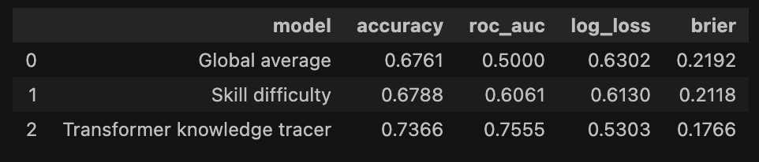
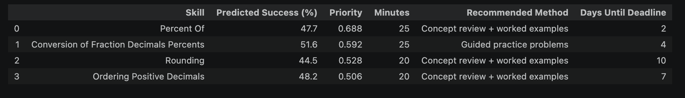

# Adaptive Study Planner

A Transformer-based adaptive study planner that models a student's learning history, estimates skill-specific success probabilities, and converts those predictions into personalized study priorities.

# Project Goal

**How can a model use a student's recent learning history to decide what they should study next?**

This project builds an end-to-end adaptive study planner using the ASSISTments 2009-2010 Skill Builder dataset.

The system has two main components:
- a Transformer-based knowledge-tracing model that predicts skill-specific success probabilities
- a planning layer that combines those predictions with deadlines, importance, review recency, and available study time

The goal is to move beyond simply predicting whether a student will answer correctly and instead use those predictions to support an actual study decision.

# Model

The main model is **a query-based Transformer knowledge tracer**.

Each previous learning interaction is represented as

$$
E_{\text{skill}}(s_t)
+
E_{\text{response}}(r_t)
+
E_{\text{type}}(c_t)
+
E_{\text{position}}(t).
$$

A Transformer encoder contextualizes the student's recent sequence of interactions.

For a target skill $s^*$, the skill embedding is used as a query:

$$
\mathrm{MHA}(q, H, H),
\qquad
q = E_{\text{skill}}(s^*).
$$

The model then estimates

$$
P(
\text{correct}=1
\mid
\text{student history}, s^*
).
$$

This allows the same student history to produce different predictions for different skills rather than reducing the student to one overall score.

# Experimental Setup

- **Dataset**: ASSISTments 2009-2010 Skill Builder
- **Task**: Binary prediction of whether the next response is correct
- **Model**: Query-based Transformer encoder
- **Maximum history length**: 100 interactions
- **Baselines**: Global average correctness, Skill-difficulty baseline
- **Evaluation metrics**: Accuracy, ROC-AUC, Log loss, Brier score

# Results

The Transformer outperforms both non-personalized baselines.
This suggests that the **student's individual learning history contains useful predictive information beyond average skill difficulty**.

# Adaptive Study Planner

The Transformer provides a predicted success probability $p$ for each candidate skill.
The planner converts this prediction into a weakness score

$$
W = 1-p.
$$

It then combines model-estimated weakness with deadline urgency, importance, and review recency:

$$
0.55W
+
0.20D
+
0.15I
+
0.10R,
$$

where

$$
D = e^{-d/7}
$$

represents deadline urgency for $d$ days until the deadline.

The remaining components are:
- $W$: predicted weakness
- $D$: deadline urgency
- $I$: user-provided importance
- $R$: review recency

## Study Method Recommendation

The planner also assigns a simple study method based on predicted skill readiness.
Lower predicted success may lead to: concept review, worked examples, guided practice
Moderate readiness may lead to: mixed practice, retrieval practice
Higher readiness may lead to: brief spaced review

These rules are intentionally kept separate from the learned model.
The Transformer learns from student interaction data, while the planning logic remains explicit and interpretable.

## End-to-End Pipeline

For a student with learning history $H$, candidate skills

$$
S = {s_1, s_2, \ldots, s_n},
$$

and a fixed study-time budget $T$, the system:

1. estimates

$$
P(\text{correct} \mid H, s_i)
$$

for each candidate skill

2. converts those probabilities into weakness estimates

3. combines them with deadlines and importance

4. ranks skills by priority

5. distributes the available study time

6. recommends a study method for each selected skill

In the demonstration, the planner creates a complete study schedule under a 90-minute total time budget.

## Main Takeaway

- A student's sequential learning history can be useful not only for predicting the next response, but also **for deciding what the student may need to study next**.
- The Transformer provides personalized estimates of skill readiness, while the planning layer converts those estimates into an understandable study schedule.
- The project therefore separates two problems:
$$
\text{Prediction}
\neq
\text{Planning}.
$$

The learned model answers: **How prepared does the student appear to be for this skill?**

The planner answers: **Given limited time and real constraints, what should the student study now?**

## Future Work

The model predicts the probability that the next response will be correct:

$$
P(\text{next response correct}).
$$

This is used as an approximation of skill readiness, but it is not a direct measurement of whether a study recommendation improves learning.

Possible extensions include:
- uncertainty estimates for skill predictions
- learned or optimized planner weights
- richer user constraints such as schedules and preferred study methods
- longer-term modeling of student progress
- evaluation of whether following recommendations improves later performance
A future version could optimize planning decisions using observed learning outcomes rather than manually defined weights.

## Tools

- Python
- pandas
- NumPy
- PyTorch
- scikit-learn
- Matplotlib
- Transformer encoders

## Notebook

See [study_planner.ipynb](study_planner.ipynb) for the full implementation.
